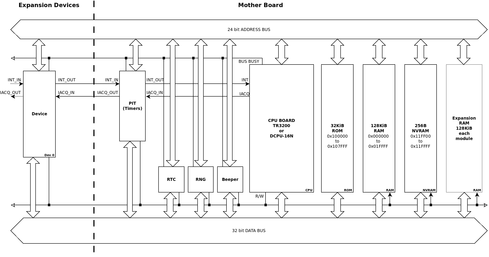

Proposition of Trillek Computer Specs
=====================================
Version 0.3 

**ADVICE** : In this documents there some technical stuff that could looks hard
or complex to understand for not hardware guys.
Some of these stuff there is only to give natural limitations of what can do 
and can't do the computer. If your only interest is programing the computer, 
you should check the instruction set of the CPU and the specs of the devices to
understand how program the computer and use the devices at assembly programing
level.

SUMMARY
------

- 32 bit address space.
- I/O devices are memory mapped.
- 128 KiB + 64Kib of ROM as base configuration. RAM expandable in chunks of 
  128KiB.
- Motherboard includes a Speaker, Clock and a *Timer* devices.
- To 32 devices via expansion bus.
- Hardware Enumeration, but not hot plug-in of devices.
- Devices can be configured via physical *jumper* (switchs). These jumpers can be read
  from the software to allow some basic Plug & Play.

HOW WORKS
---------

As can you see, the computer uses a 32 bit Address Bus and 32 bit Data bus. RAM
and ROM are directly attached to these buses, as any device in the computer
that is controllable by software. There is a special integrated device, the **Hardware Enumerator**
, plus four integrated devices, the **Programmable Interval Timers** (PIT),
 a **Speaker**, the **Random Number Generator** (RNG) and the **Real Time Clock** (RTC).

### Interrupts

As can you read in the TR3200 CPU specs, only can accept a single interrupt 
petition. To handle simultaneous interrupts, we daisy chain the IACQ and INT signals between devices, so the most nearly device to the CPU (lowest slot number) have preference over the rest.

**NOTE FOR USERS**: In other words, interrupt handlers are atomic, can't be 
interrupted by other interrupt, and you only need to worry about the interrupt 
message in your **Interrupt Service Routine** (ISR). This stuff is to put some limitations to the computer and 
add some details at implementation of it.

**NOTE FOR VM IMPLEMENTATION**: This means that when you executes the hardware 
devices, you only need to loop the device array in order and check if device
**x** send a IRQ. If it happens, allow it to send the message to the CPU, and 
just ignore the IRQs for the rest of the loop.

### Hardware Enumerator and Plug & Play

The Hardware enumerator is a device that a boot time, halts the CPU using the 
WAIT line before begin to execute instructions, and begin to poll the 32 
possible devices. When it ends to poll, it allows the CPU to begin to execute 
instructions. In this way determines how many devices they are in the 
expansion bus. The software can poll the Hardware Enumerator about a particular device slot to get information about it and his jumpers values. Addtitionaly cointains a few read only registers with information about the computer itself, as clock speed and motherboard build id.

**NOTE FOR USERS**: You only need to worry that this device allows (reading/writing a particular addresses) to know how 
many devices they are, what device are and how are configured.

**NOTE FOR VM IMPLEMENTATION**: Number of devices comes from the length of the 
array of devices, the rest of the data can come from getters/setters in the device class.

### PIT (PROGRAMMABLE INTERVAL TIMER)

The PIT consists in two 32 bit timers as can you find in any modern 
micro-controller. Allow to do precise time measurements and generate periodic 
interrupts for system clock and tasks switchers. Have the highest priority when needs to signal a interrupt.

**NOTE FOR USERS**: Could look a bit more hard that the Noth's DCPU-16 Timer 
device, but gives more freedom and control. Plus is more easy to 
understand and use that the IBM PC timer. Using the highest interrupt priority means that will be the
first Interrupt to be attended by the CPU when simultaneous interrupts happens.

**NOTE FOR VM IMPLEMENTATION**: Uses two vars per timer. One stores the Reload 
value and the other count downs every timer clock tick. The times generated are
in VM time, so if you run the VM at 200% speed, the times should be the half.

### RTC (Real Time Clock)

Is a basic device that gives the actual game time and date. Not have alarm, so is necessary doing a polling every 12 or 24 hours to keep a software clock in sync with game time.

### RNG (Random Number Generator)
Is a basic device that writing to it, sets the RNG seed, and reading from it, gets a 32 bit random number.

### Speaker
Simple basic Speaker with similar functionality to the IBM PC speaker or ZX 
Spectrum beeper. It have less power as can't allow do PWM to generate basic crude PCM sound
, but it makes a lot more simple to use and understand.

**NOTE FOR VM IMPLEMENTATION**: Try to use a Band-Limited Sound Synthesis lib 
to generate square wave sound. 

### Devices with DMA (Direct Memory Access)
There is a signal in the diagram (BUSY BUS) that indicates if the CPU or any device is using DATA and ADDRESS
busses. This should allow to use devices with integrated DMAs (important for floppies, hard disk and network devices),
to operate in the system. 

**NOTE FOR VM IMPLEMENTATION**: By practical reasons, this will translated in a flag in the VM to indicate if a device
will being doing DMA, as can't be two devices doing a DMA at same time. Additionally the max DMA transfer rate will be
of 4 bytes every four clock cycles.

DOCUMENTS
---------

- [TR3200 CPU](./TR3200.md)
- [DCPU-16 CPU](./DCPU-16.md)
- [Hardware Enumeration](./Hardware_Enumeration.md)
- [Programmable Interval Timer](./Timers.md) (aka Timer or Clock)
- [Speaker](./Speaker.md)
- [Generic Keyboard](./Keyboard.md)
- [Color Display Adapter](./CDA.md) (CDA)
- [Computer Architecture Diagram](./computer.dia) (DIA file)
- [Calling Conventions](./calling_convention.md)

REFERENCE IMPLEMENTATION
------------------------
See [TR3200-VM](https://github.com/trillek-team/trillek-tr3200-vm). Also, can run in you [browser](http://cpu.zardoz.es).
